# Cosmotiva

**Cosmotiva** is a premium cosmetics-analysis application built with Flutter. It leverages the power of AI to help users understand the ingredients in their cosmetic products, ensuring they make informed decisions about what they apply to their skin.

## 🚀 Features

*   **AI-Powered Analysis**: Utilizes Google's Gemini AI to analyze product ingredients and provide detailed insights.
*   **Ingredient Scanning**: Scan product labels (feature in development) or input ingredients manually for instant analysis.
*   **Safety Ratings**: Get safety ratings and potential hazard warnings for each ingredient.
*   **User Authentication**: Secure login and signup functionality powered by Firebase Authentication.
*   **History & Favorites**: Save your analyzed products to your history or mark them as favorites for quick access.
*   **Premium UI/UX**: A sleek, dark-themed interface designed for a premium user experience.
*   **Monetization**: Integrated Google Mobile Ads for sustainable app development.

## 🛠️ Tech Stack

*   **Framework**: [Flutter](https://flutter.dev/)
*   **Language**: [Dart](https://dart.dev/)
*   **State Management**: [Riverpod](https://riverpod.dev/)
*   **Backend / Auth**: [Firebase](https://firebase.google.com/) (Auth, Core, Firestore)
*   **AI**: [Google Gemini API](https://ai.google.dev/)
*   **Ads**: [Google Mobile Ads](https://pub.dev/packages/google_mobile_ads)
*   **Local Storage**: [Flutter Secure Storage](https://pub.dev/packages/flutter_secure_storage)

## 📂 Project Structure

The project follows **Clean Architecture** principles to ensure scalability and maintainability:

```
lib/
├── core/           # Core utilities, constants, and errors
├── data/           # Data layer (API calls, local storage implementations)
├── domain/         # Domain layer (Entities, Repository interfaces, Use cases)
├── presentation/   # UI layer (Pages, Widgets, ViewModels/Providers, Theme)
├── services/       # External services (Auth, AI, Ads, etc.)
└── main.dart       # App entry point
```

## 📐 Architecture & Design

### Use Case Diagram
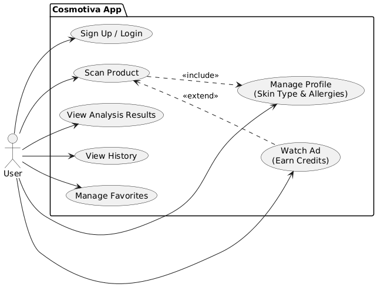

### Class Diagram


### Sequence Diagram (Scan Feature)


### Activity Diagram (Onboarding)
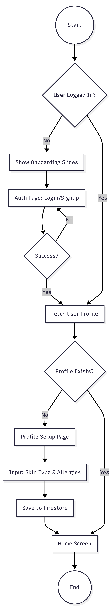

### Deployment Diagram
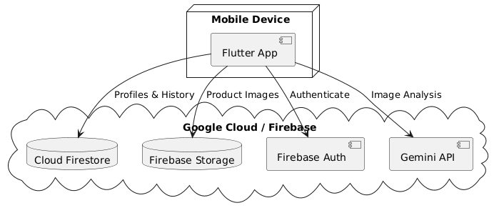

## 🏁 Getting Started

### Prerequisites

*   [Flutter SDK](https://docs.flutter.dev/get-started/install) installed.
*   An IDE (VS Code or Android Studio) with Flutter plugins.
*   A Firebase project set up.
*   A Google Gemini API key.

### Installation

1.  **Clone the repository:**
    ```bash
    git clone https://github.com/codnizer/cosmotiva_app.git
    cd cosmotiva
    ```

2.  **Install dependencies:**
    ```bash
    flutter pub get
    ```

3.  **Configure Firebase:**
    *   Ensure you have the `flutterfire_cli` installed.
    *   Run `flutterfire configure` to generate `firebase_options.dart`.

4.  **Environment Setup:**
    *   Create a `.env` file in the root directory (if using `flutter_dotenv`, otherwise check `lib/core/constants.dart` for API key configuration).
    *   *Note: Currently, the API key might be hardcoded in `lib/main.dart` or `lib/core/constants.dart` for development. Ensure to secure this for production.*

5.  **Run the app:**
    ```bash
    flutter run
    ```

## 📱 Screenshots

### Onboarding
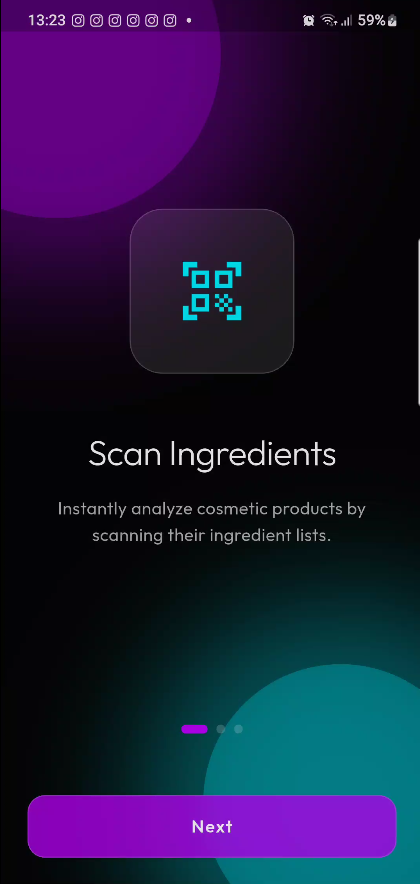 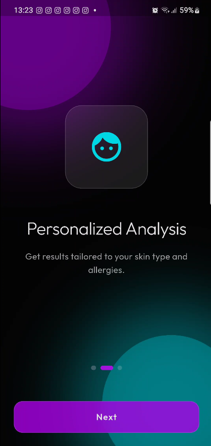 

### Authentication
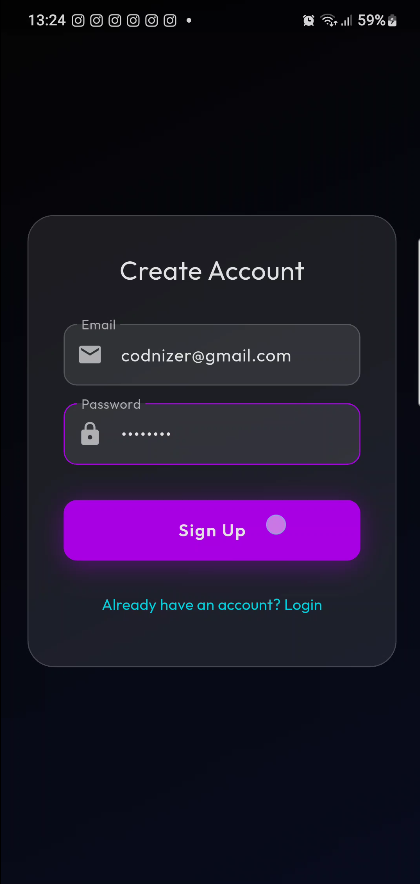 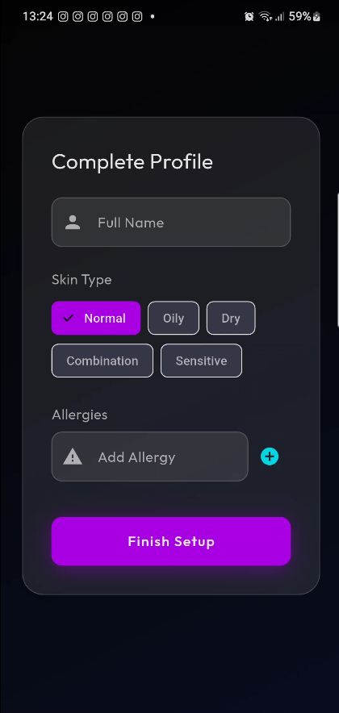

### Scanning & Analysis
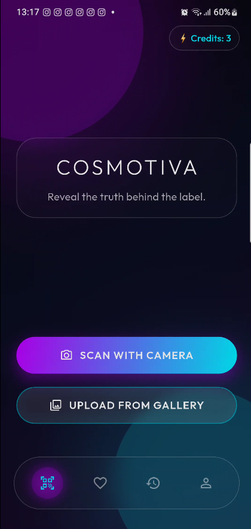  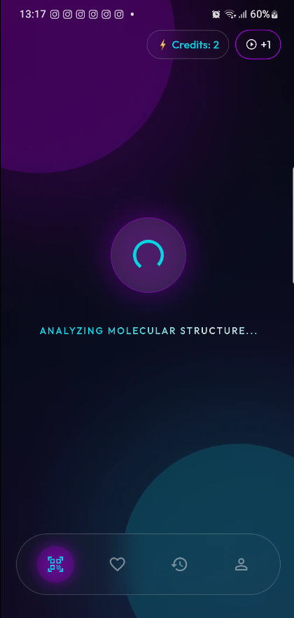
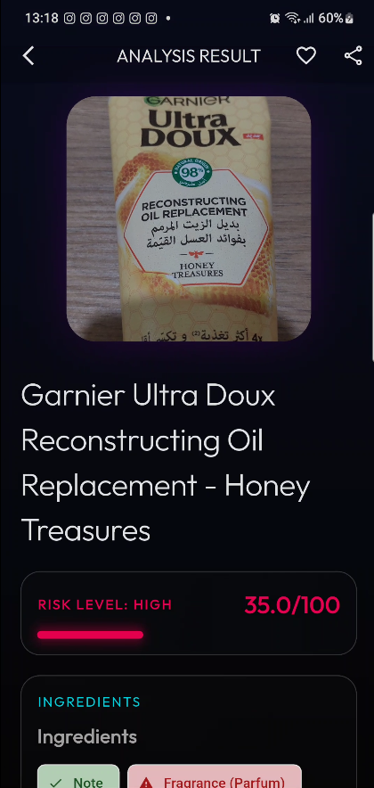 

### Profile & History
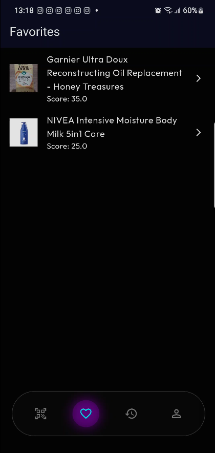 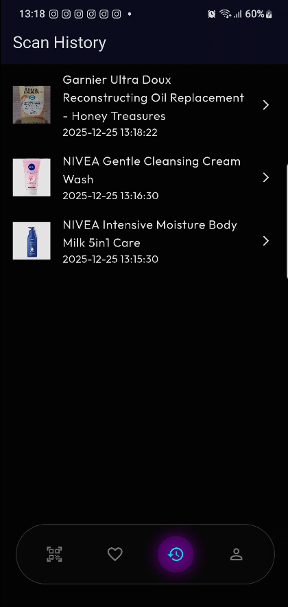 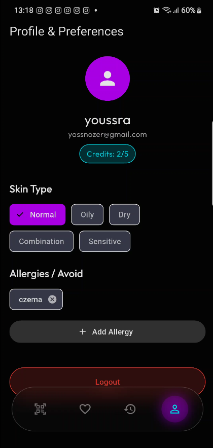

### Monetization
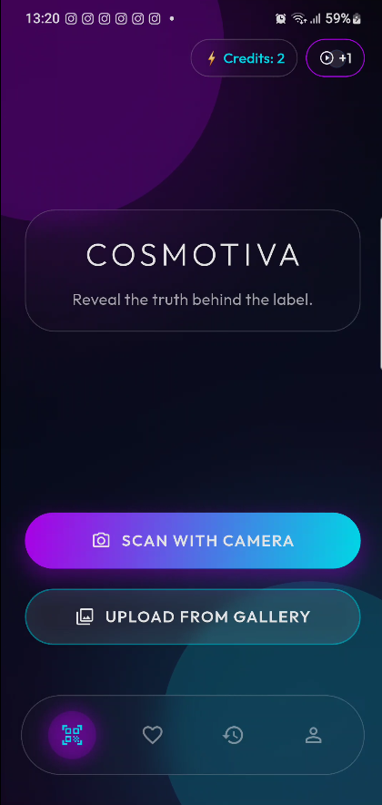 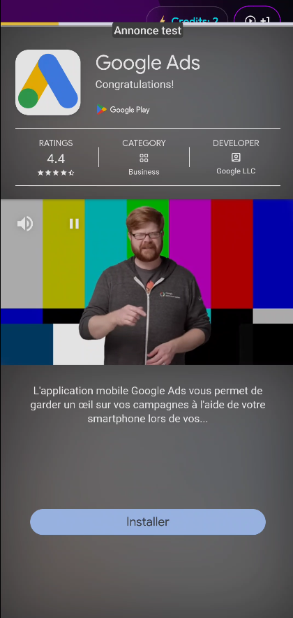 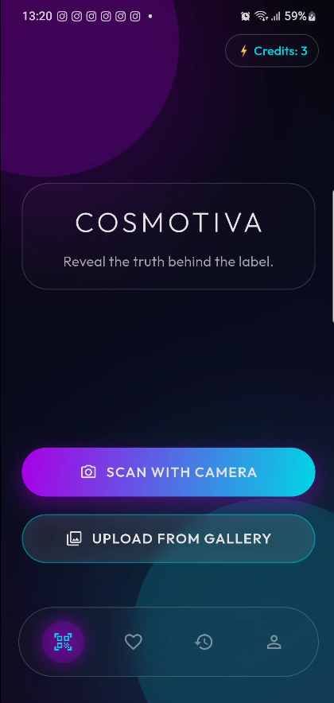

 
# cosmotiva_app
# cosmotiva_app
# cosmotiva_app
